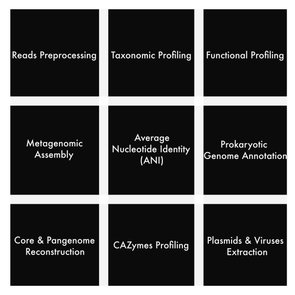

# slurm-computing-family
This repo is a family of utilities which are used for running common bioinformatics tools on HPC-SLURM.

### Download
~~~
git clone git@github.com:KunDHuang/slurm-computing-family.git
~~~

### Manuals
* [Preprocessing](./docs/preprocessing_reads.md)
* [Taxonomic Profiling](./docs/slurm-metaphlan4.md)
* [Functional Profiling](./docs/slurm-humann3.md)
* [Average Nucleotide Identity](./docs/slurm-pyani.md)
* [Prokaryotic genome annotation](./docs/slurm-prokka.md)

**NOTE**: The architecture of `slurm-computing-family` was designed for performing general microbiome analysis on [HZI Bioinf Cluster](https://bioinfhead01.helmholtz-hzi.de/docs/index.html).
