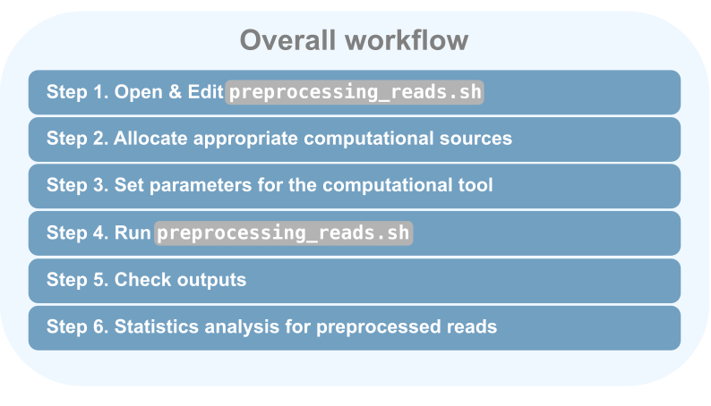

# Preprocessing metagenomic reads with ``preprocessing_reads.sh``
------------------------------------------------------------------




### Brief description
This script will clean and filter the sequencing reads from Illumina platform before further downstream analyses.<br>


### Environment preparation
The parameters in the script can be edited based on `project requirements`, `Output directory`, and `FastQ directory`. <br>

The script below is a template of the `preprocessing_reads_trlesker` <br>

**Output**
- Filtered and cleaned `FastQ` files
- `Log files` for each sample processed 

## Requirement
_________________________________________
- **[BBDuk](https://jgi.doe.gov/data-and-tools/software-tools/bbtools/bb-tools-user-guide/bbmap-guide/)** 
- **[BBMap](https://jgi.doe.gov/data-and-tools/software-tools/bbtools/bb-tools-user-guide/bbmap-guide/)**


## SLURM parameter
_________________________________________

``` json
#SBATCH --job-name=Donor5
#SBATCH --array=1-20%4 
#SBATCH --ntasks=16
#SBATCH --partition=cpu
#SBATCH --output /vol/cluster-data/khuang/slurm_stdout_logs/%x_%j.out
#SBATCH --error /vol/cluster-data/khuang/slurm_stderr_logs/%x_%j.err
#SBATCH --clusters=bioinf
#SBATCH --mem=88g
#SBATCH --time=2:00:00
```

| Component | Description  |
|:----    |:----    |
| --job-name | Job name    |
| --array | Number of array job (i.e., `#SBATCH --array=1-20%4` ==> we submit an array job with 20 tasks and 4 groups. %4 means maximum number of simultaneous tasks is limited to 4.)|
| --ntasks |    Number of tasks to be executed in parallel    |
| --partition |    Where the job to be executed (CPU or GPU)    |
| --output |    Location for standard output (stdout) log, *slurm report*, of the job    |
| --error |    Location for standard error (stderr) log, *slurm report*, of the job     |
| --clusters |    Harware cluster name for job execution   |
| --mem |    The amount of memory required for each task    |
| --time |    The maximum time limit for the job to complete |

**Note:** 
- `--array` and `--ntask` should be fitted to the number of sample to be processed.
- `--time` should be fitted to the time usage of the tools.

## Compiling
_________________________________________

``` bash
usedCores=16
WorkingDir=/vol/projects/khuang/downstream_analysis/small_bioinf_assistance/caroline_Donor5_microbiome_analysis/filteredReads
RefDir=/vol/projects/trlesker/filtering/ref-human-mask
FileListR1=/vol/projects/khuang/downstream_analysis/small_bioinf_assistance/caroline_Donor5_microbiome_analysis/FileListRawR1.txt
FileListR2=/vol/projects/khuang/downstream_analysis/small_bioinf_assistance/caroline_Donor5_microbiome_analysis/FileListRawR2.txt
FileListNames=/vol/projects/khuang/downstream_analysis/small_bioinf_assistance/caroline_Donor5_microbiome_analysis/FileListRawNames.txt
```

| Component | Description  |
|:----    |:----    |
| usedCores | Number of thread to be used in `bbduk and bbmap`    |
| WorkingDir | The output directory for **processed read** deposition|
| RefDir |    `bbmap` indexed reference location |
| FileListR1 |    FastQ R1 path    |
| FileListR2 |    FastQ R2 path    |
| FileListNames |    List of samples     |

## Running
_________________________________________

``` bash
echo "Job" ${SLURM_ARRAY_TASK_ID} "start at: "`date`
echo "Running on host: "`hostname`.
echo "With Path: "$PATH
echo "In directory: "`pwd`
echo "go to workdir"
cd ${WorkingDir}
echo "Now in directory: "`pwd`

#get file for Filelist with SGE_TASK_ID
echo "FileListR1: "  ${FileListR1}
echo "FileListR2: "  ${FileListR2}
echo "FileListNames: "  ${FileListNames}
echo "SLURM_ARRAY_TASK_ID: " ${SLURM_ARRAY_TASK_ID}
FastqPathR1=$(awk "NR==${SLURM_ARRAY_TASK_ID}" ${FileListR1})
FastqPathR2=$(awk "NR==${SLURM_ARRAY_TASK_ID}" ${FileListR2})
SampleName=$(awk "NR==${SLURM_ARRAY_TASK_ID}" ${FileListNames})

echo "Start filtering for "${SampleName}" with Files:"`date`
echo ${FastqPathR1}
echo ${FastqPathR2}

#### test if file already done
FILE=${SampleName}_cleaned_R1.fastq.gz

if [ -f "$FILE" ]; then
    echo "$FILE exists. Exit"
    exit
fi


/vol/cluster-data/trlesker/bbmap/bbduk.sh -Xmx20g usejni=t unpigz=t threads=${usedCores} \
in=${FastqPathR1} in2=${FastqPathR2} \
ref=/vol/cluster-data/trlesker/bbmap/resources/truseq.fa.gz \
minlen=25 qtrim=rl trimq=5 ktrim=l k=20 hdist=1 \
refstats=${SampleName}_truseq_ref.stats stats=${SampleName}_truseq.stats \
out=${SampleName}_trim_R1.fastq.gz out2=${SampleName}_trim_R2.fastq.gz > bbduk-${SampleName}.log 2>&1

/vol/cluster-data/trlesker/bbmap/bbmap.sh -Xmx82g usejni=t unpigz=t threads=${usedCores} \
path=${RefDir} \
minid=0.95 maxindel=3 bwr=0.16 bw=12 quickmatch fast minhits=2 qtrim=rl trimq=10 untrim \
refstats=${SampleName}_contaminant_filtering_ref.stats \
in=${SampleName}_trim_R1.fastq.gz in2=${SampleName}_trim_R2.fastq.gz \
outu=${SampleName}_cleaned_R1.fastq.gz outu2=${SampleName}_cleaned_R2.fastq.gz > bbmap-${SampleName}.log 2>&1


rm ${SampleName}_trim_R1.fastq.gz ${SampleName}_trim_R2.fastq.gz
echo "End :"`date`
```
The `cleaned FastQ files` will be located in the `WorkingDir`.

_________________________________________
##### More information 
1. [Slurm tutorial](https://slurm.schedmd.com/tutorials.html)
2. [HUMAnN3 User Guide](https://github.com/biobakery/humann)


